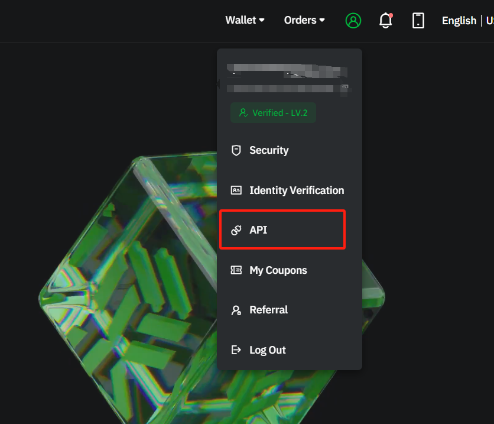
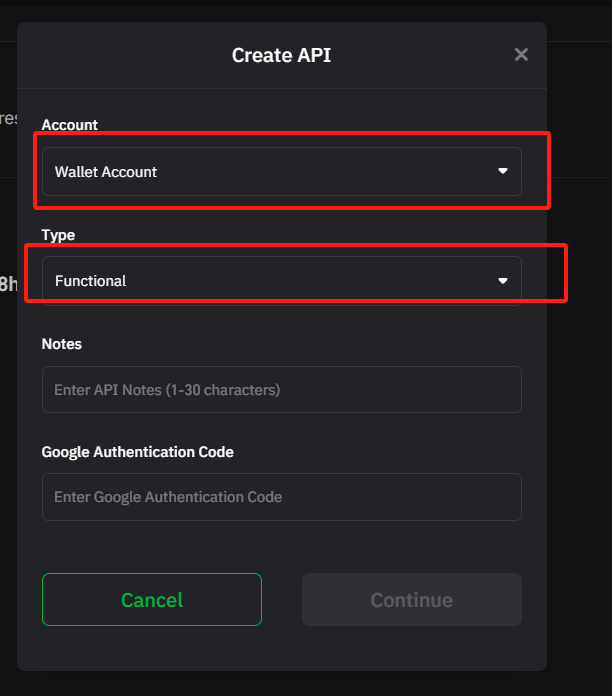
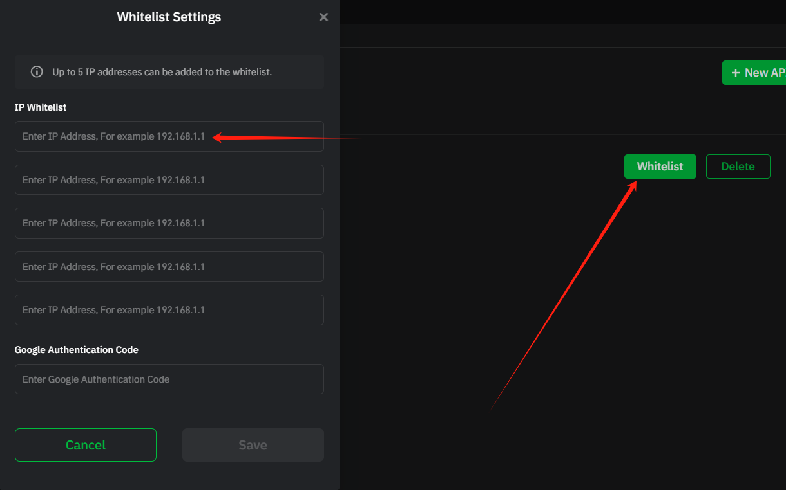

Block Trade API Documentation
=====================

## General API Information

Endpoint
``
https://api-otc.trubit.com
``

* All endpoints return either a JSON object or array.
* Data is returned in **ascending** order. Oldest first, newest last.
* All time and timestamp related fields are in milliseconds.
* HTTP `4XX` return codes are used for for malformed requests;
  the issue is on the sender's side.
* HTTP `429` return code is used when breaking a request rate limit.
* HTTP `418` return code is used when an IP has been auto-banned for continuing to send requests after receiving `429` codes.
* HTTP `5XX` return codes are used for internal errors; the issue is on broker's side.
  It is important to **NOT** treat this as a failure operation; the execution status is
  **UNKNOWN** and could have been a success.
* Any endpoint can return an ERROR; the error payload is as follows:

```javascript
{
  "code": -1121,
  "msg": "Invalid symbol."
}
```

* Specific error codes and messages defined in another document.
* For `GET` endpoints, parameters must be sent as a `query string`.
* For `POST`, `PUT`, and `DELETE` endpoints, the parameters may be sent as a
  `query string` or in the `request body` with content type
  `application/x-www-form-urlencoded`. You may mix parameters between both the
  `query string` and `request body` if you wish to do so.
* Parameters may be sent in any order.
* If a parameter sent in both the `query string` and `request body`, the
  `query string` parameter will be used.


### Endpoint security type

* Each endpoint has a security type that determines the how you will
  interact with it.
* API-keys are passed into the Rest API via the `X-BH-APIKEY`
  header.
* API-keys and secret-keys **are case sensitive**.
* API-keys can be configured to only access certain types of secure endpoints.
  For example, one API-key could be used for TRADE only, while another API-key
  can access everything except for TRADE routes.
* By default, API-keys can access all secure routes.


### SIGNED (TRADE and USER_DATA) Endpoint security

* `SIGNED` endpoints require an additional parameter, `signature`, to be
  sent in the  `query string` or `request body`.
* Endpoints use `HMAC SHA256` signatures. The `HMAC SHA256 signature` is a keyed `HMAC SHA256` operation.
  Use your `secretKey` as the key and `totalParams` as the value for the HMAC operation.
* The `signature` is **not case sensitive**.
* `totalParams` is defined as the `query string` concatenated with the
  `request body`.


### SIGNED Endpoint Examples for POST /openapi/v1/order

Here is a step-by-step example of how to send a vaild signed payload from the
Linux command line using `echo`, `openssl`, and `curl`.

Key | Value
------------ | ------------
apiKey | tAQfOrPIZAhym0qHISRt8EFvxPemdBm5j5WMlkm3Ke9aFp0EGWC2CGM8GHV4kCYW
secretKey | lH3ELTNiFxCQTmi9pPcWWikhsjO04Yoqw3euoHUuOLC3GYBW64ZqzQsiOEHXQS76

Parameter | Value
------------ | ------------
requestBody | {"id":0}
timestamp | 1538323200000

#### Example 1: As a query string

* **queryString:** symbol=ETHBTC&side=BUY&type=LIMIT&timeInForce=GTC&quantity=1&price=0.1&recvWindow=5000&timestamp=1538323200000
* **requestBodyString:** {"id":0}
* **HMAC SHA256 signature:**

```shell
[linux]$ echo -n "timestamp=1538323200000{"id":0}" | openssl dgst -sha256 -hmac "lH3ELTNiFxCQTmi9pPcWWikhsjO04Yoqw3euoHUuOLC3GYBW64ZqzQsiOEHXQS76"
(stdin)= 5fafd5098eca1e135037f335fe6a9ec6884271cb6933bd7f5ed6a3582f1f0eea
```

* **curl command:**

```shell
(HMAC SHA256)
[linux]$ curl -H "X-BH-APIKEY: tAQfOrPIZAhym0qHISRt8EFvxPemdBm5j5WMlkm3Ke9aFp0EGWC2CGM8GHV4kCYW" -X POST 'https://$HOST?1538323200000&signature=5fafd5098eca1e135037f335fe6a9ec6884271cb6933bd7f5ed6a3582f1f0eea' -d '{"id":0}'
```

How to obtain apiKey and secretKey
---------

https://www.trubit.com/new/user/interface

After creating the apiKey and secretKey, you need to set the IP whitelist.






Endpoints
---------

### 1\. Base Data


#### Get Country List with Symbol Rate

*   **Endpoint**: `/openapi/v1/otc/base/symbol_rate/country/list`
*   **Method**: GET
*   **Request Query Parameters**:
    *   `hasValid` (optional, Integer) - Filters countries by validation status.
*   **Response**: JSON containing the list of countries with symbol rates.
```text
{
  "countryList": [
    {
        "country": "Mexico",  (string: name of the country)
        "abbr": "MX",  (string: abbreviation of the country)
        "flagUrl": "http://xxx"  (string: url of the country flag)
    }
  ]
}
```

Example

```
{
    "countryList": [
        {
            "country": "Mexico",
            "abbr": "MX",
            "flagUrl": "https://xxx.png",
            "buySwitch": 1,
            "sellSwitch": 1
        },
        {
            "country": "Argentina",
            "abbr": "AR",
            "flagUrl": "https://xxx.png",
            "buySwitch": 1,
            "sellSwitch": 1
        },
        {
            "country": "Brazil",
            "abbr": "BR",
            "flagUrl": "https://xxxx.png",
            "buySwitch": 1,
            "sellSwitch": 1
        },
        {
            "country": "Colombia",
            "abbr": "CO",
            "flagUrl": "https://xxxx.png",
            "buySwitch": 0,
            "sellSwitch": 0
        },
        {
            "country": "Hong Kong",
            "abbr": "HK",
            "flagUrl": "https://xxxx.png",
            "buySwitch": 0,
            "sellSwitch": 1
        }
    ]
}

```


#### Get Self Data List

*   **Endpoint**: `/openapi/v1/otc/base/symbol/self/list_data`
*   **Method**: GET
*   **Request Query Parameters**:
    *   `country`  (string: name of the country)
    *   `hasValid` (number: whether to query only valid data [0: no (default), 1: yes])
*   **Response**: JSON containing self data list for symbols.
```text
{
        "fiatList": [ (array: list of fiat currencies)
            {
                "name": "MXN", (string: name of the fiat currency)
                "symbolList": [ (string: association list of crypto currencies)
                    "USDT",
                    "MMXN"
                ]
            },
            {
                "name": "ARS",
                "symbolList": [
                    "USDT",
                    "BTC"
                ]
            }
        ],
        "tokenList": [ (array: list of tokens)
            {
                "name": "USDT",  (string: name of the token)
                "symbolList": [ (string: association list of fiat currencies)
                    "MXN",
                    "ARS",
                    "VES",
                    "COP",
                    "TWD",
                    "MYR"
                ]
            },
            {
                "name": "MMXN",
                "symbolList": [
                    "MXN"
                ]
            }   
        ]
    }
```
### 2\. Rate Management


#### Get User Quote

*   **Endpoint**: `/openapi/v1/otc/rate/user_quote/find`
*   **Method**: POST
*   **Authorization**: Requires signature and account verification
*   **Headers**: Requires signature
    * `X-BH-APIKEY` (string: API key)
*   **Request Body**:
```text
{
  "country": "", (string: name of the country)
  "fiatCurrency": "", (string: name of the fiat currency)
  "cryptoCurrency": "" (string: name of the crypto currency)
}
```
*   **Response**: JSON containing user quote information.
```text

{
  "hasOpen": 0,  (number: Whether it is open or not[0: no, 1: yes])
  "fiatCurrency": "",  (string: name of the fiat currency)
  "cryptoCurrency": "",  (string: name of the crypto currency)
  "buyRate": 0.0,  (number: buy rate)
  "sellRate": 0.0  (number: sell rate)
}
```


### 3\. Payment Management

#### Get Payment Config List

*   **Endpoint**: `/openapi/v1/otc/payment/list`
*   **Method**: GET
*   **Request Query Parameters**:
    *   `country` (string: name of the country)
*   **Response**: JSON containing the list of payment configurations.
```text
 {
        "currencys": [  (array: list of currencies)
            {
                "id": 1, (number: id of the currency)
                "fiatCurrency": "USD" (string: name of the fiat currency)        
            }
        ], 
        "payments": [ (array: list of payments)
            {
                "id": 1,  (number: id of the payment)
                "country": "Mexico", (string: name of the country)
                "paymentType": 0,  (number: type of the payment [0: manual(default), 1: auto])
                "fieldList": [ (array: list of custom fields)
                     {
                        "index": 0, / (number: index of the field)
                        "textType": 1,    (enum: type of the text [1: number, 2: letter, 3: number+letter, 4: string, 5: image])
                        "title": "test",  (string: title of the field)
                        "promptText": "Enter number",  (string: default text of the field)
                        "isAccount": true,  (boolean: whether the field is an account)
                        "isOptional": false, (boolean: whether the field is required [true: required(default), false: optional])
                        "maxLimit": 30,    (number: maximum length of the field)
                        "text": "1234567890" (string: text of the field)
                      }
                 ], 
                "fieldNum": 1,               
                "logo": "http://paypal/123", 
                "paymentName": "Paypal" 
            }
       ]
     }
```

Example Mexico

```

{
    "currencys": [
        {
            "id": 1,
            "fiatCurrency": "MXN"
        },
        {
            "id": 3,
            "fiatCurrency": "ARS"
        }
    ],
    "payments": [
        {
            "id": 58,
            "country": "Mexico",
            "paymentName": "Automated SPEI - Arcus",
            "paymentType": 1,       
            "waitPayMoneyMinute": 0,
            "waitReceiveMoneyMinute": 0,
            "fieldList": [
                {
                    "index": 1,
                    "textType": 1,
                    "title": "Cuenta CLABE",
                    "promptText": "Cuenta CLABE de 18 d\u00edgitos",
                    "maxLimit": 100,
                    "text": "",
                    "picUrl": [],
                    "tempPicUrl": [],
                    "isOptional": false,
                    "isAccount": true
                },
                {
                    "index": 2,
                    "textType": 4,
                    "title": "Banco",
                    "promptText": "",
                    "maxLimit": 100,
                    "text": "",
                    "picUrl": [],
                    "tempPicUrl": [],
                    "isOptional": false,
                    "isAccount": false
                }
            ],
            "fieldNum": 2
        }
    ]
}
```


#### Add Payment

*   **Endpoint**: `/openapi/v1/otc/payment/add`
*   **Method**: POST
*   **Authorization**: Requires signature and account verification
*   **Headers**: Requires signature
    * `X-BH-APIKEY` (string: API key)
*   **Request Body**:
 ```text
{
    "mcId": 1, (number: id of the merchant)
    "country": "Mexico", (string: name of the country)
    "fiatCurrency": "USD",(string: name of the fiat currency)
    "paymentConfigId": 1, (number: id of the payment configuration)
    "paymentLogo": "http://localhost/123",  (string: url of the payment logo)
    "paymentMethodName": "Paypal",  (string: name of the payment method)
    "realName": "xiaoming",  (string: name of the real name)
    "fieldJson": [  (array: list of custom fields)
        {
            "index": 0,  (number: index of the field)
            "textType": 1, (enum: type of the text [1: number, 2: letter, 3: number+letter, 4: string, 5: image])
            "title": "Account",  (string: title of the field)
            "promptText": "",   (string: default text of the field)
            "isAccount": true,  (boolean: whether the field is an account)
            "isOptional": false, (boolean: whether the field is required [true: required(default), false: optional])
            "maxLimit": 30,      (number: maximum length of the field)
            "text": "1234567890",  (string: text of the field)
            "picUrl":["http://localhost/1", "http://localhost/2"], (array: list of image links)
            "tempPicUrl":["http://localhost/1", "http://localhost/2"]             (array: list of temporary image links)
        }
    ],
    "remark": "", (string: remark of the payment method)
}
```

*   **Response**: JSON containing the result of the add payment operation.

```
{
    "result": true,
    "msg": ""
}

```


### 4\. Merchant Management

#### Get Merchant List

*   **Endpoint**: `/openapi/v1/otc/mc/list`
*   **Method**: GET
*   **Authorization**: Requires signature and account verification
*   **Headers**: Requires signature
    * `X-BH-APIKEY` (string: API key)
*   **Response**: JSON containing the list of merchants.
```text
[
        {    
            "id": 1,  (number: id of the merchant)
            "country": "Mexico",  (string: name of the country)
            "merchantName": "TestMc",  (string: name of the merchant)
            "paymentId": 26,  (number: id of the payment method)
            "paymentMethodName": "Paypal",  (string: name of the payment method)
            "fiat": "MXN",  (string: name of the fiat currency)
            "buyLimit":"10000.00",  (number: buy limit of the fiat currency)
            "buyUsed":"2000.00",  (number:  buy used of the fiat currency)
            "sellLimit":"10000.00",  (number: sell limit of the fiat currency)
            "sellUsed":"2000.00"  (number: sell used of the fiat currency)
        }
]
```
### 5\. Order Management

#### Get Order List

*   **Endpoint**: `/openapi/v1/otc/order/list`
*   **Method**: GET
*   **Authorization**: Requires signature and account verification
*   **Headers**: Requires signature
    * `X-BH-APIKEY` (string: API key)
*   **Request Parameters**:
    *   `currentPage` (number,default 1)
    *   `pageSize` (number,default 10)
    *   `isPending` (optional, boolean: whether the order is pending [true: pending, false: not pending])
*   **Response**: JSON containing the list of orders.
```text
{
    "currentPage": 1,  (number: current page number)
    "size": 10, (number: number of results per page)
    "total": 100, (number: total number of results)
    "pendingOrders": 4 (number: number of pending orders)
    "record":[ (array: list of orders)
        {
        "orderId": "419798134177140736",  (number: id of the order)
        "userId": "1434127291173059584",  (number: id of the user)
        "accountId": "1434127291173059585",  (number: id of the user account)
        "cryptoCurrency": "USDT", (string: name of the crypto currency)
        "cryptoLogo": "https://xxx.png",  (string: logo of the crypto currency)
        "fiatCurrency": "MXN",  (string: name of the fiat currency)
        "orderPrice": "700.00",  (decimal: order price)
        "quantity": "10.00",  (decimal: order quantity)
        "fiatAmount": "7000.00", (decimal: order amount)
        "orderType": "SELL ",L  (enum: order type [BUY: buy, SELL: sell])
        "orderStatus": "30",  (enum: order status [10: pending, 30: approved, 40: pending payment, 50: paid, 60: released, 70: canceled, 80: rejected by self])
        "deptPaymentMethodName": "Mercadopago (Mexico)",  (string: name of the merchant payment method)
        "deptPaymentMethodColor": "#4658C1", (string: color of the merchant payment method)
        "orderApprovedTime": "1722229752000", (number: timestamp of the order approved)
        "hasRefund": 1, (enum: whether the order is a refund order [0: no, 1: yes])
        "hasSelf": 1,  (enum: whether the order is a self order [0: no, 1: yes])
     ]
    }
}
```


#### Get Order Detail

*   **Endpoint**: `/openapi/v1/otc/order/detail`
*   **Method**: GET
*   **Authorization**: Requires signature and account verification
*   **Headers**: Requires signature
    * `X-BH-APIKEY` (string: API key)
*   **Request Parameters**:
    *   `orderId` (number: id of the order)
*   **Response**: JSON containing the details of the specified order.
```text
{
    "orderId": "1", (number: id of the order)
    "userId": "1", (number: id of the user)
    "accountId": "1", (number: id of the user account)
    "cryptoCurrency": "token", (string: name of the crypto currency)
    "cryptoLogo": "token logo", (string: logo of the crypto currency)
    "fiatCurrency": "MXN", (string: name of the fiat currency)
    "orderPrice": "1", (decimal: order price)
    "quantity": "1", (decimal: order quantity)
    "fiatAmount": "1", (decimal: order amount)
    "orderType": "BUY", (enum: order type [BUY: buy, SELL: sell])
    "orderStatus": "10", (enum: order status [10: pending, 30: approved, 40: pending payment, 50: paid, 60: released, 70: canceled, 80: rejected by self])
    "orderApprovedTime": "", (number: timestamp of the order approved)
    "orderTimeFrameMinute": "", (number: time frame of the payment (minute))
    "orderConfirmTimestamp": "", (number: timestamp of the order confirmed (second))
    "orderExpireTimestamp": "", (number: timestamp of the order expired (second))
    "mark": "",                (string: remark)
    "mcId": 1,(number: id of the merchant)
    "mcName": "pel",(string: name of the merchant)
    "traclingNumber": "987654321",(number: transaction number)
    "companyName": "System",(string: name of the company)
    "hasRefund": 1,(enum: whether the order is a refund order [0: no, 1: yes])
    "hasSelf": 1,(enum: whether the order is a self order [0: no, 1: yes])
    "paymentType": 1,(enum: type of the payment method [0: manual(default), 1: automatic])
    "deptPaymentInfo": { (object: merchant payment method information)
        "id": "1", (number: id of the payment method)
        "name": "Paypal",(string: name of the payment method)
        "logo": "http://localhost/123",(string: logo of the payment method)
        "color": "",(string: color of the payment method)
        "paymentFieldList": [  (array: list of custom fields)
            {
                "index": 0,(number: index of the field)
                "textType": 1,(enum: type of the text [1: number, 2: letter, 3: number+letter, 4: string, 5: image])
                "title": "Account",(string: title of the field)
                "promptText": "",(string: default text of the field)
                "isAccount": true,(boolean: whether the field is an account)
                "isOptional": false,(boolean: whether the field is required [true: required(default), false: optional])
                "maxLimit": 30,(number: maximum length of the field)
                "text": "1234567890",(string: text of the field)
                "picUrl":["http://localhost/1", "http://localhost/2"],(array: list of image links)
                "tempPicUrl":["http://localhost/1", "http://localhost/2"],              (array: list of temporary image links)
            }
        ]
     }, 
     "userPaymentInfo": { (object: user payment method information)
        "id": "1", (number: id of the payment method)
        "name": "Paypal",(string: name of the payment method)
        "logo": "http://localhost/123",(string: logo of the payment method)
        "color": "",(string: color of the payment method)
        "paymentFieldList": [  (array: list of custom fields)
            {
                "index": 0,(number: index of the field)
                "textType": 1,(enum: type of the text [1: number, 2: letter, 3: number+letter, 4: string, 5: image])
                "title": "Account",(string: title of the field)
                "promptText": "",(string: default text of the field)
                "isAccount": true,(boolean: whether the field is an account)
                "isOptional": false,(boolean: whether the field is required [true: required(default), false: optional])
                "maxLimit": 30,(number: maximum length of the field)
                "text": "1234567890",(string: text of the field)
                "picUrl":["http://localhost/1", "http://localhost/2"],(array: list of image links)
                "tempPicUrl":["http://localhost/1", "http://localhost/2"],(array: list of temporary image links)
            }
        ]
     }
}
```
Buy Order Example

```
{
    "orderId": "433576705563561984",
    "userId": "1489875904414977024",
    "accountId": "1489875904414977025",
    "cryptoCurrency": "USDT",
    "cryptoLogo": "https://xxxx.png",
    "fiatCurrency": "MXN",
    "orderPrice": "20.07",
    "quantity": "0.4982",
    "fiatAmount": "10",
    "orderType": "BUY",
    "paymentType": 1,
    "orderStatus": 40,
    "hasRefund": 0,
    "hasSelf": 2,
    "orderApprovedTime": "1725849618000",
    "orderTimeFrameMinute": 15,
    "orderConfirmTimestamp": "1725849542",
    "orderExpireTimestamp": "1725850518",
    "completedTime": "1725849542000",
    "mark": "",
    "deptPaymentInfo": {
        "id": 0,
        "name": "Automated SPEI - Arcus",
        "logo": "https://xxxx.png",
        "color": "",
        "realName": "HONGYI TANG API",
        "paymentFieldList": [
            {
                "index": 1,
                "textType": 1,
                "title": "Cuenta CLABE",
                "promptText": "Cuenta CLABE de 18 d\u00edgitos",
                "maxLimit": 100,
                "text": "706180101615753153",
                "picUrl": [],
                "tempPicUrl": [],
                "isOptional": false,
                "isAccount": true
            },
            {
                "index": 2,
                "textType": 4,
                "title": "Banco",
                "promptText": "",
                "maxLimit": 100,
                "text": "ARCUS",
                "picUrl": [],
                "tempPicUrl": [],
                "isOptional": false,
                "isAccount": false
            }
        ]
    },
    "mcId": 227,
    "mcName": "HONGYI TANG API",
    "traclingNumber": "",
    "companyName": "API TEST ACCOUNT",
    "createTime": "1725849542000",
    "updateTime": "1725849618000"
}
```
Sell Order Example

```
{
    "orderId": "433592805818896384",
    "userId": "1489875904414977024",
    "accountId": "1489875904414977025",
    "cryptoCurrency": "USDT",
    "cryptoLogo": "https://xxx.png",
    "fiatCurrency": "MXN",
    "orderPrice": "19.91",
    "quantity": "0.2",
    "fiatAmount": "3.98",
    "orderType": "SELL",
    "paymentType": 1,
    "orderStatus": 60,
    "hasRefund": 0,
    "hasSelf": 2,
    "orderApprovedTime": "1725853455000",
    "orderTimeFrameMinute": 240,
    "orderConfirmTimestamp": "1725853380",
    "orderExpireTimestamp": "1725867854",
    "completedTime": "1725853833000",
    "mark": "",
    "deptPaymentInfo": {
        "id": 58,
        "name": "Automated SPEI - Arcus",
        "logo": "https://xxx.png",
        "color": "",
        "realName": "",
        "paymentFieldList": []
    },
    "userPaymentInfo": {
        "id": 221,
        "name": "Automated SPEI - Arcus",
        "logo": "https://xxx.png",
        "color": "",
        "realName": "test-api-add",
        "paymentFieldList": [
            {
                "index": 1,
                "textType": 1,
                "title": "Cuenta CLABE",
                "promptText": "Cuenta CLABE de 18 d\u00edgitos",
                "maxLimit": 100,
                "text": "012180015049733082",
                "picUrl": [],
                "tempPicUrl": [],
                "isOptional": false,
                "isAccount": true
            },
            {
                "index": 2,
                "textType": 4,
                "title": "Banco",
                "promptText": "",
                "maxLimit": 100,
                "text": "BBVA",
                "picUrl": [],
                "tempPicUrl": [],
                "isOptional": false,
                "isAccount": false
            }
        ]
    },
    "mcId": 227,
    "mcName": "HONGYI TANG API",
    "traclingNumber": "2024090890706GA27Y4BFDRDHAD3X",
    "companyName": "API TEST ACCOUNT",
    "createTime": "1725853381000",
    "updateTime": "1725853833000"
}

```


#### Finish Order

*   **Endpoint**: `/openapi/v1/otc/order/finish`
*   **Method**: POST
*   **Authorization**: Requires signature and account verification
*   **Headers**: Requires signature
    * `X-BH-APIKEY` (string: API key)
*   **Request Body**:
```text
{
    "orderId": 1123123123,  (number: id of the order)
}
```
*   **Response**: JSON containing the result of the order finish.
```
{
  "result": true,
  "msg": ""
}
```
#### Add Order

*   **Endpoint**: `/openapi/v1/otc/order/add`
*   **Method**: POST
*   **Authorization**: Requires signature and account verification
*   **Headers**: Requires signature
    * `X-BH-APIKEY` (string: API key)
*   **Request Body**:
```text
{       
    "country":"Mexico", (string: name of the country)
    "mcId":3,  (number: id of the merchant)
    "cryptoCurrency":"USDT", (string: name of the crypto currency)
    "fiatCurrency":"MXN", (string: name of the fiat currency)
    "quantity":100.00, (decimal: order quantity)
    "orderAmount":1000.00, (decimal: order amount)
    "orderType":"SELL",(enum: order type [BUY: buy, SELL: sell])
    "paymentId":"91",  (number: id of the payment method)
}       
```
*   **Response**: JSON containing the result of the add order operation.
```text
{
    "orderId": 1123123123,  (number: id of the order)
}
```


### 6\. Deposit Management

#### Get Deposit Address

*   **Endpoint**: `/openapi/v1/otc/depositAddress`
*   **Method**: GET
*   **Authorization**: Requires signature and account verification
*   **Headers**: Requires signature
    * `X-BH-APIKEY` (string: API key)
*   **Request Query Parameters**:
    *   `tokenId` (String) - ID of the token
    *   `chainType` (optional, String) - Type of the blockchain (default: "")
*   **Response**: JSON containing the deposit address.
```text
{
    "allowDeposit": false, (boolean: whether the deposit is allowed)
    "address": "", (string: address of the deposit)
    "addressExt": "", (string: address tag)
    "minQuantity": "", (string: minimum amount of the deposit)
    "needAddressTag": false, (boolean: whether the address tag is required)
    "requiredConfirmNum": 0, (number: required confirmation number)
    "canWithdrawConfirmNum": 0, (number: maximum confirmation number)
    "tokenType": "" (string: type of the token)
}
```

Example tokenId = USDT ,chainType = ERC20

```text
{
    "allowDeposit": true,
    "address": "0x895f6ab44fb0da1102ab1beb4995e42d74***41",
    "addressExt": "",
    "minQuantity": "5",
    "needAddressTag": false,
    "requiredConfirmNum": 64,
    "canWithdrawConfirmNum": 64,
    "tokenType": "ERC20_TOKEN"
}
```
Token Id | ChainType
------------ | ------------
USDT | ERC20
USDT | TRC20


### 7\. Account Management

#### Get Account Info

*   **Endpoint**: `/openapi/v1/otc/account`
*   **Method**: GET
*   **Authorization**: Requires signature and account verification
*   **Headers**: Requires signature
    * `X-BH-APIKEY` (string: API key)
*   **Response**: JSON containing account information.
```text
{
  "accountId": 0, (number: id of the account)
  "accountName": "", (string: name of the account)
  "accountType": 0, (number: type of the account)
  "accountIndex": 0, (number: index of the account)
  "canTrade": false, (boolean: whether the account can trade)
  "canDeposit": false, (boolean: whether the account can deposit)
  "canWithdraw": false, (boolean: whether the account can withdraw)
  "balances": [
    {
      "asset": "", (string: name of the asset)
      "assetId": "", (string: id of the asset)
      "assetName": "", (string: name of the asset)
      "total": "", (string: total amount of the asset)
      "free": "", (string: free amount of the asset)
      "locked": "" (string: locked amount of the asset)
    }
  ],
  "updateTime": 0 (number: update time of the account)
}
```

Example

```text
{
    "balances": [
        {
            "asset": "USDT",
            "assetId": "USDT",
            "assetName": "USDT",
            "total": "0.2982",
            "free": "0.2982",
            "locked": "0"
        }
    ]
}
```
