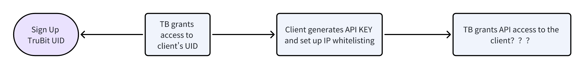
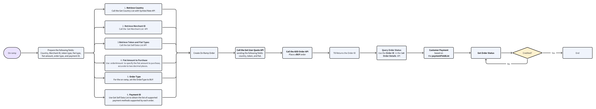
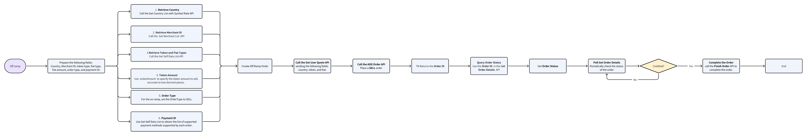

## (ENG) Ramp-aas API User Guide
### Getting Started
The TruBit Business account manager opens a digital assets account for the API client’s UID. After the client logs into the TB Pro Web using the UID, they generate an API public and private key and configure the IP whitelist. Once completed, provide the UID to the TB account manager to enable OPEN API access.



- Register TruBit UID: https://www.trubit.com/new/signup
- How to get an API key and configure the White List: https://www.trubit.com/new/user/interface

### On-ramp Process (Pay-in)


#### 1. Getting Ready for Your On Ramp
Here’s what you need to get started: Country, Merchant ID, Token type, Fiat type, Fiat amount, Order type, and Payment ID.

**1. Country**
- Call the Get Country List with Symbol Rate API to find your country.
  
**2. Merchant ID**
- Call Get Merchant List to retrieve the Merchant ID linked to your UID and note it down for your on ramp.

**3. Token and Fiat Types**
- Call Get Self Data List to discover the supported trading pairs and fiat currencies.
  - Note: This might also be referred to as Get Trading Pair List.

**4. Fiat Amount**
- Use orderAmount to specify how much fiat you want to buy, accurate to two decimal places.
- Note: If it exceeds two decimal places, the system will round down.
  
**5. Order Type**
- For on ramps, always set OrderType to BUY.

**6. Payment Method**
- Use Get Self Data List to find the supported payment methods for each trading pair and record the corresponding Payment ID.
- Check the payment method supported by your order at this step.

#### 2. Create On Ramp Order

**1. Call the ```Get User Quote``` API to get a quote**

Send the following fields:
  - Country
  - Token
  - Fiat

**2. Call the```ADD Order``` API to place a buy order** 

Fields to be sent:
  - "country": from Get Country List with Symbol Rate
  - "mcId": from Get Merchant List
  - "cryptoCurrency": from Get Country List with Symbol Rate
  - "fiatCurrency": from Get Country List with Symbol Rate
  - "orderAmount": enter the fiat amount
  - "orderType": fixed as "BUY"
  - "paymentId": from the autoApiFiatPaymentList field in Get Self Data List
**3. Retrieve an Order ID**
After placing the order, use Get Order Details to query the order information and status. The returned information will be:

```
{
    "orderId": "433576705563561984",
    "userId": "1489875904414977024",
    "accountId": "1489875904414977025",
    "cryptoCurrency": "USDT",
    "cryptoLogo": "https://static.mexo.vip/token_v2/USDT.png",
    "fiatCurrency": "MXN",
    "orderPrice": "20.07",
    "quantity": "0.4982",
    "fiatAmount": "10",
    "orderType": "BUY",
    "paymentType": 1,
    "orderStatus": 40,
    "hasRefund": 0,
    "hasSelf": 2,
    "orderApprovedTime": "1725849618000",
    "orderTimeFrameMinute": 15,
    "orderConfirmTimestamp": "1725849542",
    "orderExpireTimestamp": "1725850518",
    "completedTime": "1725849542000",
    "mark": "",
    "deptPaymentInfo": {
        "id": 0,
        "name": "Automated SPEI - Arcus",
        "logo": "https://static.mexo.vip/bhop/image/3_54uOUcE5FTVsk5ls3b0H3JiWom1Wnqt8DtQQ3Mqi8.png",
        "color": "",
        "realName": "TRUBIT API",
        "paymentFieldList": [
            {
                "index": 1,
                "textType": 1,
                "title": "Cuenta CLABE",
                "promptText": "Cuenta CLABE de 18 d\u00edgitos",
                "maxLimit": 100,
                "text": "706180101615753153",
                "picUrl": [],
                "tempPicUrl": [],
                "isOptional": false,
                "isAccount": true
            },
            {
                "index": 2,
                "textType": 4,
                "title": "Banco",
                "promptText": "",
                "maxLimit": 100,
                "text": "ARCUS",
                "picUrl": [],
                "tempPicUrl": [],
                "isOptional": false,
                "isAccount": false
            }
        ]
    },
    "mcId": 227,
    "mcName": "TRUBIT API",
    "traclingNumber": "",
    "companyName": "API TEST ACCOUNT",
    "createTime": "1725849542000",
    "updateTime": "1725849618000"
}

```
**4. Customer Payment**

The customer makes a payment using the information in the paymentFieldList.

**5. Poll for Order Status**

After the payment, the customer needs to periodically call Get Order Details to query the status of the order.

### Off Ramp Process (Pay-out)


#### 1. Getting Started
The required information to initiate an off ramp includes: Country, Merchant ID, Token type, Fiat type, the amount of Tokens to sell, Order Type, and Payment ID.

**1.1 Country**

  - Call the Get Country List with Symbol Rate API to query the country list.
  
**1.2 Merchant ID**
  - Call Get Merchant List to retrieve the Merchant ID under the UID and record the Merchant ID for the off ramp.
  
**1.3 Token and Fiat Types**
  - Call Get Self Data List to get the supported trading pairs and fiat currencies.
  - *Note: This may be replaced with Get Trading Pair List.*
  
**1.4 Amount of Tokens to Sell**
  - Use quantity to input the number of tokens to sell, accurate to two decimal places.
    *- Note: If the amount exceeds two decimal places, the system will round down and keep two decimal places.*

**1.5 Order Type**
  - Set OrderType to SELL for the off ramp.
  
**1.6 Payment ID**
  - If a payment method has not been set up, bind it first:
    1. Retrieve basic information by calling Get Merchant List to get the Merchant ID.
    2. Use Get Self Data List to obtain the list of supported payment methods for each trading pair and record the corresponding Payment ID.
      - At this step, query the payment method supported by the order and record the Payment ID.
    3. Use Get Payment Config List to get details on all supported payment methods and required fields (including validation expressions).
      - At this step, use the Payment ID to query the fields required for the selected payment method.
    4. Add the payment method via the Add Payment API. (Refer to payments.fieldList for field requirements.)
      - If successful, it returns true.
    5. Use Get My Payment Methods API to verify if the payment method has been added successfully.
      - Once added successfully, you can proceed with the off ramp. Ensure the Payment ID is noted for future off ramps using the same Merchant ID.

#### 2. Create the Off Ramp Order
**2.1 Call Get ```User Quote``` API to get a quote**

Send the following fields to retrieve a quote:
  - Country
  - Token
  - Fiat
  
**2.2 Use ```ADD Order``` API to place an off ramp order**

Check if the trading pair supports the Payment ID for the off ramp:
  *- Note: The merchant must have a successfully bound payment method to initiate the off ramp.*

**2.3 Place the Off Ramp Order**

Send the following fields:

```
    sell_amount = 0.2 （Token amount）
    add_order({
        "country": country,
        "mcId": mc_id,
        "cryptoCurrency":token,
        "fiatCurrency": fiat,
        "quantity":sell_amount,
        "orderType": "SELL",
        "paymentId": payment_id,
    })
```

**4. Retrieve an Order ID**

After placing the order, use Get Order Details to query the order information and status.

**5. Order Status**

When the order status shows 50 (Paid), it indicates the system has completed the off ramp.
- Once the merchant receives the payment, they can call the Finish Order API to complete the transaction.
- New Requirement: If the order is not confirmed within 30 minutes, the system will automatically complete it. If there are any issues, contact the OTC account manager immediately.

#### Other Features

**1. Balance Inquiry**
  - Use Account Management to check account balances.
  
**2. Retrieve Order List**

  - Use the Get Order List API to retrieve orders, passing time period and status parameters.
    - If no time period is provided, all orders will be returned.
    - If no status is provided, orders of all statuses will be returned.
**3. Deposit Token**

  Refer to the relevant table to understand the supported tokens and chains, and use the Get Deposit AddressAPI to retrieve deposit addresses.

| Token ID      | Chain Type |
| ----------- | ----------- |
| USDT      | ERC20,TRC20,BEP,Polygon       |
| USDC   | ERC20,BEP20,Polygon,Stellar        |
|Other|Contact the account manager|

**4. Special Notes**
- If the customer overpays during an on ramp, contact the TB account manager to initiate a refund via the Broker management backend. The customer’s funds will be refunded through the original payment method.